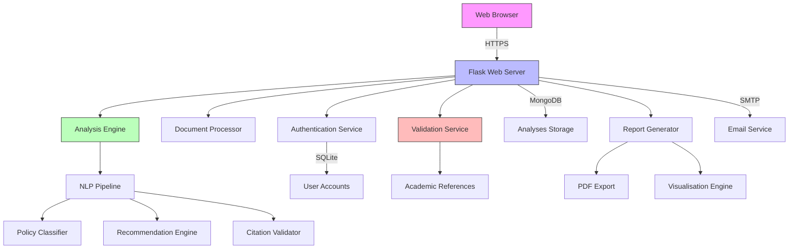

# PolicyCraft System Architecture

## Core Components

1. **Web Interface**
   - Responsive HTML5/CSS3 frontend
   - Interactive visualisations using Plotly.js
   - Accessible UI components (WCAG 2.2 AA compliant)

2. **Backend Services**
   - **Authentication Service**: Manages user sessions and permissions
   - **Document Processor**: Handles file uploads and text extraction
   - **Analysis Engine**: Coordinates the policy analysis workflow
   - **Validation Service**: Verifies academic citations and references

3. **Analysis Components**
   - **NLP Pipeline**: Text preprocessing and feature extraction
   - **Policy Classifier**: Hybrid model for policy categorisation
   - **Recommendation Engine**: Suggests policy improvements
   - **Citation Validator**: Ensures academic rigour of sources

4. **Data Storage**
   - **MongoDB**: Stores analysis results and document metadata
   - **SQLite**: Manages user accounts and authentication
   - **Reference Database**: Curated collection of academic sources

5. **Output Generation**
   - **Report Generator**: Creates comprehensive policy analysis reports
   - **Visualisation Engine**: Generates interactive charts and metrics
   - **PDF Export**: Produces printable policy documents

## Data Flow

1. User uploads a policy document through the web interface
2. Document is processed and analysed by the NLP pipeline
3. Policy Classifier categorises the document
4. Recommendation Engine generates improvement suggestions
5. Validation Service checks academic citations
6. Results are stored and presented to the user
7. User can export findings in multiple formats

## Security Considerations

- All communications are encrypted using TLS 1.3
- Authentication uses secure, HTTP-only cookies
- Passwords are hashed using Bcrypt
- Regular security audits are performed

_Last Updated: 24 July 2025_
