# PolicyCraft System Architecture
# ==============================
# System design documentation for PolicyCraft - AI policy analysis platform
#
# Author: Jacek Robert Kszczot
# Project: MSc Data Science & AI - COM7016
# University: Leeds Trinity University
# Last Updated: August 2025

## System Overview

PolicyCraft employs a modular, microservice-inspired architecture built on Flask, designed for analysing AI policies in higher education institutions. The system integrates natural language processing, machine learning, and knowledge management to provide comprehensive policy assessment and recommendations.

```mermaid
graph TD
    %% Client Layer
    A[Web Browser] -->|HTTPS/TLS 1.3| B[Flask Application Server]
    
    %% Core Application Layer
    B --> C[Authentication & Session Management]
    B --> D[Document Processing Pipeline]
    B --> E[Advanced Analysis Engine]
    B --> F[Knowledge Base Manager]
    B --> G[Export & Reporting System]
    
    %% Analysis Components
    E --> E1[Multi-dimensional NLP Pipeline]
    E1 --> E2[Hybrid Policy Classifier]
    E1 --> E3[Theme Extraction Engine]
    E1 --> E4[Confidence Assessment]
    E --> E5[Recommendation Generator]
    E5 --> E6[Literature Integration]
    
    %% Document Management
    D --> D1[Multi-format Parser]
    D1 --> D2[Text Quality Assessment]
    D1 --> D3[Manual Review Queue]
    D --> D4[Automated Backup System]
    
    %% Knowledge Management
    F --> F1[Academic Literature Repository]
    F --> F2[Citation Validation Engine]
    F --> F3[Version Control System]
    
    %% Export Systems
    G --> G1[PDF Report Generator]
    G --> G2[Word Document Export]
    G --> G3[Excel Data Export]
    G --> G4[Interactive Visualisation Engine]
    
    %% Data Persistence
    B -->|Primary Storage| H[(MongoDB Atlas)]
    C -->|User Management| I[(User Database)]
    F1 -->|Literature Cache| J[(Knowledge Base Files)]
    D4 -->|Backup Storage| K[(Backup Repository)]
    
    %% External Integration
    B -->|Email Notifications| L[SMTP Service]
    E1 -->|NLP Models| M[spaCy & Transformers]
    G4 -->|Chart Generation| N[Plotly Ecosystem]
    
    %% Styling
    style A fill:#e1f5fe,stroke:#01579b,stroke-width:2px
    style B fill:#f3e5f5,stroke:#4a148c,stroke-width:2px
    style E fill:#e8f5e8,stroke:#1b5e20,stroke-width:2px
    style G fill:#fff3e0,stroke:#e65100,stroke-width:2px
    style H fill:#fce4ec,stroke:#880e4f,stroke-width:2px
```

## Core System Components

### 1. Web Application Layer
- **Frontend Framework**: Responsive HTML5/CSS3 with progressive enhancement
- **Template Engine**: Jinja2 with custom filters for policy formatting
- **Client-Side Enhancement**: Vanilla JavaScript with Plotly.js for visualisations
- **Accessibility Compliance**: WCAG 2.2 AA standards throughout interface
- **Responsive Design**: Mobile-first approach supporting all device types

### 2. Authentication & Security Infrastructure
- **User Management**: Flask-Login with role-based access control
- **Session Security**: HTTP-only, secure cookies with CSRF protection
- **Admin Interface**: Dedicated administrative dashboard with enhanced privileges
- **Password Security**: Bcrypt hashing with configurable work factor
- **Multi-layer Authentication**: Support for admin and standard user roles

### 3. Document Processing Pipeline
- **Multi-format Support**: PDF (PyMuPDF, pypdf, pdfplumber), DOCX, plain text
- **Intelligent Parsing**: Adaptive text extraction with quality assessment
- **Manual Review System**: Queue-based approval workflow for quality control
- **Backup Management**: Automated versioning with configurable retention
- **Processing Analytics**: Comprehensive logging and performance metrics

### 4. Advanced Analysis Engine
- **NLP Pipeline**: Multi-stage processing using spaCy and custom models
- **Policy Classification**: Hybrid rule-based and ML approach for categorisation
- **Theme Extraction**: Semantic analysis identifying key policy dimensions
- **Confidence Metrics**: Multi-factor assessment of analysis reliability
- **Contextual Analysis**: Integration with academic literature for enhanced insights

### 5. Knowledge Base Management
- **Literature Repository**: Curated collection of 17+ peer-reviewed sources
- **Citation Integration**: Automatic reference validation and linking
- **Version Control**: Comprehensive tracking of knowledge base updates
- **Quality Assessment**: Scoring system for source reliability and relevance
- **Backup & Recovery**: Automated preservation of knowledge base state

### 6. Recommendation Generation System
- **Multi-dimensional Analysis**: Stakeholder perspectives and implementation timelines
- **Evidence-based Suggestions**: Grounded in academic literature and best practices
- **Contextual Recommendations**: Tailored to specific policy types and institutions
- **Impact Assessment**: Urgency-feasibility-impact matrix for prioritisation
- **Implementation Guidance**: Pilot programmes and evaluation frameworks

### 7. Export & Reporting Infrastructure
- **PDF Generation**: Professional reports using ReportLab with custom styling
- **Word Documents**: Native .docx export with proper formatting and tables
- **Excel Workbooks**: Multi-sheet data exports with embedded analytics
- **Interactive Charts**: Plotly-powered visualisations with export capabilities
- **Consistent Branding**: Unified design across all export formats

## Data Architecture

### Primary Data Stores
- **MongoDB Database**: Primary storage for analyses, user data, and system logs
- **File System**: Secure document storage with organised directory structure
- **Knowledge Base**: Markdown-based literature repository with metadata
- **Backup Storage**: Automated snapshots with configurable retention policies

### Data Flow Architecture
1. **Document Ingestion**: Multi-format parsing with quality validation
2. **Analysis Processing**: NLP pipeline with confidence assessment
3. **Knowledge Integration**: Literature matching and citation validation
4. **Result Generation**: Comprehensive analysis with recommendation synthesis
5. **Export Production**: Multi-format output with consistent presentation
6. **Data Persistence**: Secure storage with automated backup procedures

## Security & Compliance Framework

### Data Protection
- **Encryption**: TLS 1.3 for all communications, encrypted storage for sensitive data
- **Access Control**: Role-based permissions with audit logging
- **Data Minimisation**: Collection limited to functional requirements
- **Retention Policies**: Configurable data lifecycle management

### System Security
- **Input Validation**: Comprehensive sanitisation of all user inputs
- **CSRF Protection**: Token-based protection for state-changing operations
- **Session Management**: Secure cookie configuration with appropriate expiration
- **Dependency Management**: Regular security updates and vulnerability scanning

### Academic Integrity
- **Source Verification**: Automated validation of academic citations
- **Plagiarism Prevention**: Original analysis with clear source attribution
- **Research Ethics**: Compliance with educational research guidelines
- **Transparency**: Open methodology with reproducible results

## Performance & Scalability

### Optimisation Strategies
- **Caching Systems**: Strategic caching of expensive NLP operations
- **Database Indexing**: Optimised queries for common access patterns
- **Lazy Loading**: Progressive enhancement for improved perceived performance
- **Resource Management**: Efficient memory usage during document processing

### Monitoring & Analytics
- **System Health**: Comprehensive monitoring of application performance
- **Usage Analytics**: Non-intrusive tracking of system utilisation
- **Error Handling**: Graceful degradation with informative user feedback
- **Dependency Validation**: Startup checks ensuring system readiness

## Development & Deployment

### Code Organisation
- **Modular Design**: Clear separation of concerns across functional domains
- **Blueprint Architecture**: Flask blueprints for organised route management
- **Configuration Management**: Environment-based settings with secure defaults
- **Testing Framework**: Comprehensive test suite ensuring system reliability

### Dependency Management
- **Requirements**: Separated production, development, and testing dependencies
- **Version Control**: Pinned versions ensuring reproducible deployments
- **Security Updates**: Regular dependency auditing and update procedures
- **Documentation**: Clear installation and setup procedures

---

*This architecture documentation reflects the current state of PolicyCraft as implemented for academic research in AI policy analysis. The system design prioritises academic rigour, user experience, and technical reliability whilst maintaining compliance with educational technology standards.*